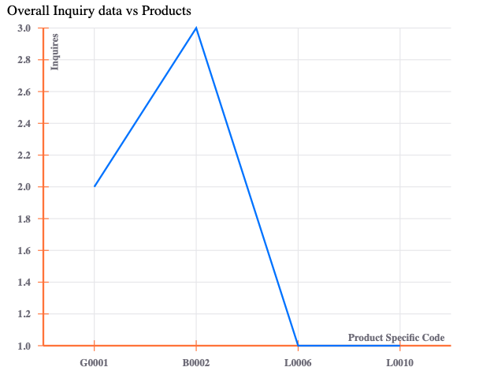
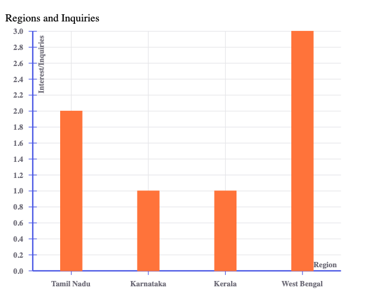
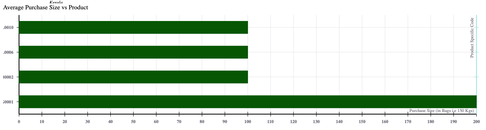

****Please note that this is an outdated repository. Please consider checking out the newer repository is available [here](https://github.com/sanjitk7/yarnTradingCompanyFrontendv2)\****

## Frontend For a Yarn Trading Company Web App

An Inventory Management and Business Intelligence Web Application for a typical Small scale trading company in the textile industry.

*ReactJS Frontend*

Employee Login Page -> localhost:3000/login (Authentication Done)

1. **Employee Dashboard ( CRUD Operations for Products)**
2. **Inquiry Page (Create Inquiry Form Submission )**
3. **Admin Dashboard ( Create Employee Account + Visualizations )**
4. Public Products Page (Only R, No CUD)
5. Public Home Page (Information about Company)

### Frontend flow

## Visualizations

Product Codes against Number of Inquiries

Inquiries and Regions

Products Average Purchase Size

Yarn Count and Inquiry

### Deployment

Find the relaxant backend repository [here](https://github.com/sanjitk7/yarnTradingCompanyBackendv1)

